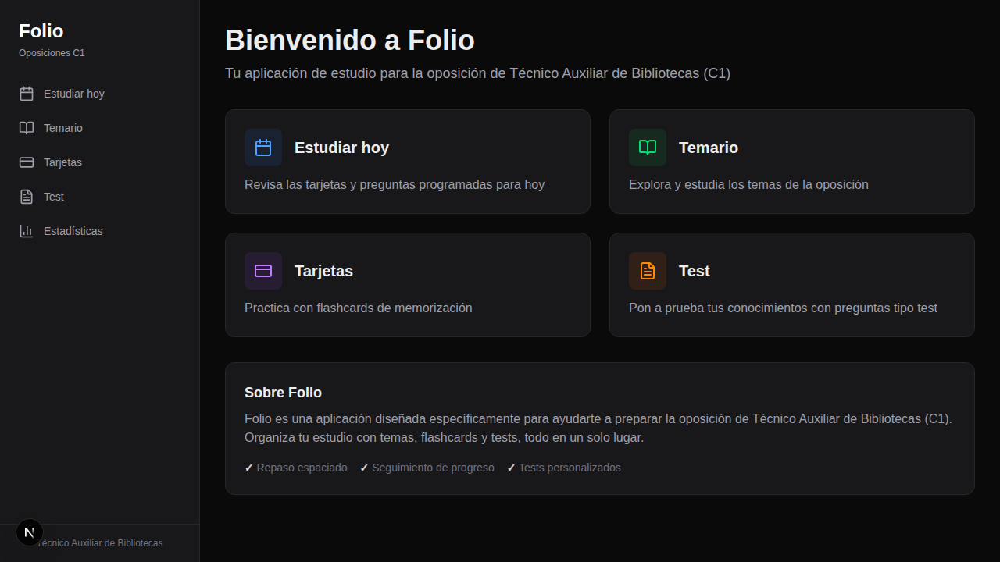
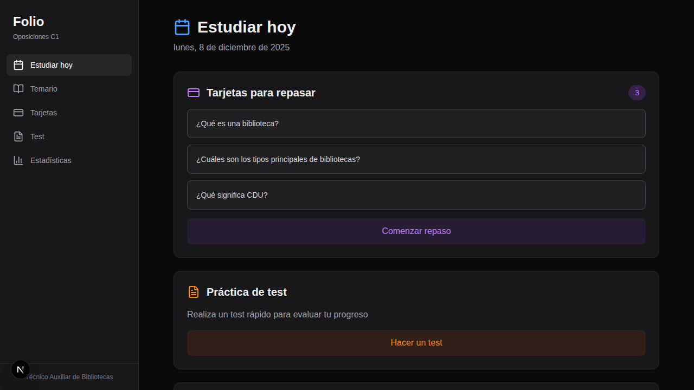
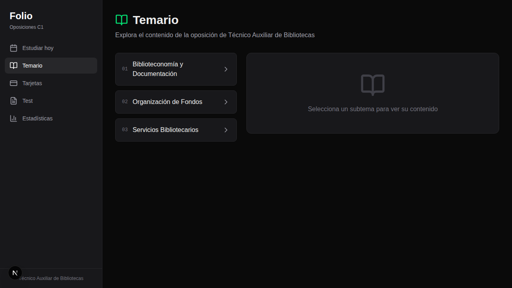
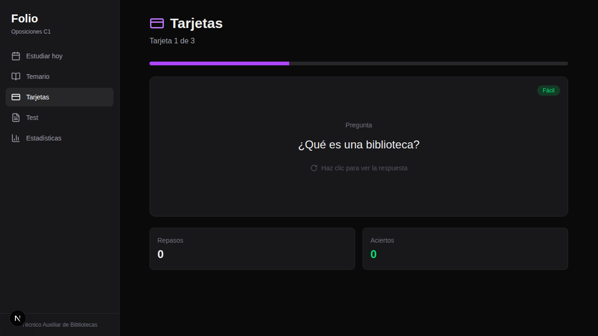
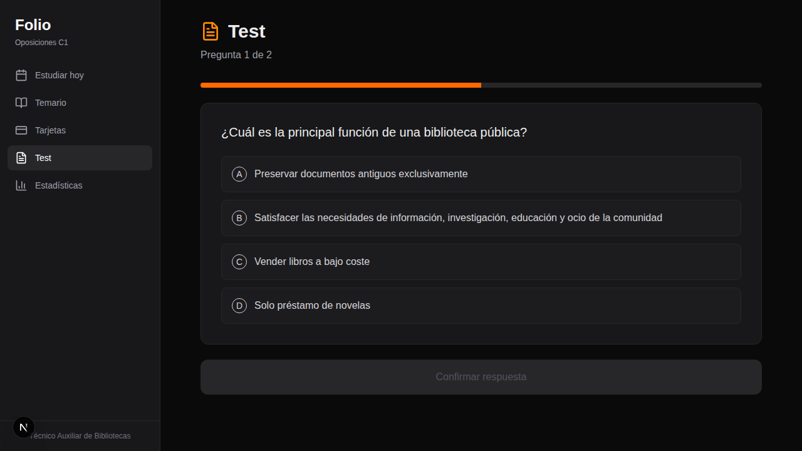
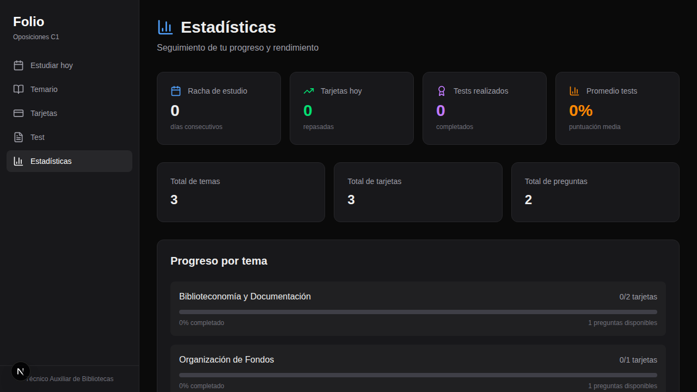

# Manual de Usuario - Folio

Folio es una aplicación de estudio diseñada para opositores que quieren aprobar de forma inteligente, organizada y sin perder tiempo. Esta guía te ayudará a conocer todas las funcionalidades de la aplicación.

## Índice

1. [Acceso y Autenticación](#acceso-y-autenticación)
2. [Página de Inicio](#página-de-inicio)
3. [Estudiar Hoy](#estudiar-hoy)
4. [Temario](#temario)
5. [Tarjetas (Flashcards)](#tarjetas-flashcards)
6. [Test](#test)
7. [Estadísticas](#estadísticas)

---

## Acceso y Autenticación

Folio requiere autenticación con tu cuenta de GitHub para acceder al área de estudio.

### Cómo iniciar sesión:

1. Accede a la página principal de Folio
2. Haz clic en **"Empezar"** o **"Acceso Usuarios Beta"**
3. Serás redirigido a GitHub para autorizar la aplicación
4. Una vez autorizado, volverás automáticamente al dashboard

### Tu cuenta:

- Se utiliza tu cuenta de GitHub para identificarte
- Tus datos de estudio (progreso, estadísticas) se guardan localmente en tu navegador
- Cada usuario tiene sus propios datos aislados

### Cerrar sesión:

- En el dashboard, haz clic en tu nombre de usuario en la barra lateral
- Selecciona **"Cerrar sesión"**
- Serás redirigido a la página principal

### Programa Beta:

Actualmente Folio está en fase beta. Si quieres participar:
- Solicita acceso mediante el [formulario de beta](https://forms.office.com/r/zn5AwbZxmD)
- Tu feedback nos ayuda a mejorar la aplicación

---

## Página de Inicio

La página de inicio te da la bienvenida a Folio y te proporciona acceso rápido a todas las secciones principales de la aplicación.

### Características principales:

- **Navegación lateral**: Acceso rápido a todas las secciones desde el menú lateral izquierdo
- **Accesos directos**: Tarjetas con enlaces directos a cada sección
- **Información sobre Folio**: Descripción de las principales características de la aplicación

### Secciones disponibles:

- **Estudiar hoy**: Revisa las tarjetas y preguntas programadas para hoy
- **Temario**: Explora y estudia los temas de la oposición
- **Tarjetas**: Practica con flashcards de memorización
- **Test**: Pon a prueba tus conocimientos con preguntas tipo test

---

## Estudiar Hoy

Esta sección te muestra un resumen de lo que debes estudiar en el día actual, incluyendo las tarjetas pendientes de repaso y acceso a los tests.

### Funcionalidades:

- **Fecha actual**: Muestra la fecha del día de estudio
- **Tarjetas para repasar**: Lista de tarjetas programadas para repaso según el algoritmo de repaso espaciado
- **Práctica de test**: Acceso rápido para realizar un test de evaluación
- **Consejo del día**: Consejos útiles para mejorar tu estudio

### Cómo usar:

1. Revisa las tarjetas pendientes de repaso
2. Haz clic en "Comenzar repaso" para iniciar la sesión de tarjetas
3. Realiza un test para evaluar tu progreso
4. Sigue los consejos del día para mejorar tu estudio

---

## Temario

La sección de Temario te permite explorar todo el contenido organizado por temas de la oposición de Técnico Auxiliar de Bibliotecas.

### Estructura del temario:

El temario está organizado en bloques principales:

1. **Biblioteconomía y Documentación**: Conceptos fundamentales sobre bibliotecas
2. **Organización de Fondos**: Clasificación y catalogación de materiales
3. **Servicios Bibliotecarios**: Servicios que ofrecen las bibliotecas

### Cómo usar:

1. Selecciona un bloque temático del menú lateral
2. Haz clic en el tema que deseas estudiar
3. Explora el contenido del subtema seleccionado
4. Navega entre subtemas usando los botones de navegación

---

## Tarjetas (Flashcards)

El sistema de tarjetas utiliza la técnica de repaso espaciado para ayudarte a memorizar conceptos clave de manera efectiva.

### Características:

- **Pregunta y respuesta**: Cada tarjeta tiene una pregunta en el anverso y la respuesta en el reverso
- **Nivel de dificultad**: Las tarjetas están clasificadas por dificultad (Fácil, Media, Difícil)
- **Progreso**: Barra de progreso que muestra tu avance en la sesión
- **Estadísticas**: Número de repasos y aciertos por tarjeta

### Sistema de repaso espaciado:

- **Primera vez correcta**: Repaso en 2 días
- **Segunda vez correcta**: Repaso en 4 días
- **Tercera vez correcta**: Repaso en 6 días
- **Respuesta incorrecta**: Repaso al día siguiente

### Cómo usar:

1. Lee la pregunta mostrada en la tarjeta
2. Piensa en la respuesta antes de revelarla
3. Haz clic en la tarjeta para ver la respuesta
4. Indica si acertaste o fallaste para programar el próximo repaso
5. Continúa hasta completar todas las tarjetas de la sesión

---

## Test

La sección de Test te permite practicar con preguntas tipo test similares a las del examen real.

### Características:

- **Preguntas de opción múltiple**: Formato similar al examen oficial
- **Cuatro opciones**: Cada pregunta tiene 4 posibles respuestas (A, B, C, D)
- **Progreso**: Indicador del número de pregunta actual
- **Confirmación**: Botón para confirmar tu respuesta antes de continuar

### Cómo usar:

1. Lee atentamente la pregunta
2. Analiza todas las opciones disponibles
3. Selecciona la respuesta que consideres correcta haciendo clic en ella
4. Haz clic en "Confirmar respuesta" para validar tu selección
5. Revisa la explicación si está disponible
6. Continúa con la siguiente pregunta

### Consejos:

- Lee todas las opciones antes de responder
- No te precipites, analiza bien cada pregunta
- Aprende de los errores revisando las explicaciones

---

## Estadísticas

La sección de Estadísticas te permite hacer un seguimiento detallado de tu progreso y rendimiento en el estudio.

### Métricas principales:

- **Racha de estudio**: Días consecutivos que has estudiado
- **Tarjetas hoy**: Número de tarjetas repasadas en el día
- **Tests realizados**: Cantidad de tests completados
- **Promedio tests**: Puntuación media en los tests

### Totales:

- Total de temas disponibles
- Total de tarjetas en el sistema
- Total de preguntas de test

### Progreso por tema:

Para cada tema del temario puedes ver:
- Número de tarjetas completadas vs. totales
- Porcentaje de completado
- Número de preguntas disponibles

### Motivación:

La aplicación incluye mensajes motivacionales para animarte a mantener tu constancia en el estudio.

---

## Consejos Generales

1. **Estudia todos los días**: La constancia es más importante que la cantidad
2. **Usa el repaso espaciado**: Confía en el sistema de tarjetas para optimizar tu memoria
3. **Practica con tests**: Realiza tests regularmente para evaluar tu progreso
4. **Revisa tus estadísticas**: Mantén un seguimiento de tu avance para identificar áreas de mejora
5. **Mantén tu racha**: Intenta estudiar al menos un poco cada día para mantener tu racha activa

---

## Soporte

Si tienes alguna pregunta o sugerencia sobre Folio, puedes:
- Consultar el README del proyecto
- Abrir un issue en el repositorio de GitHub

---

*Manual de Folio - Aplicación de estudio para oposiciones de Técnico Auxiliar de Bibliotecas (C1)*
