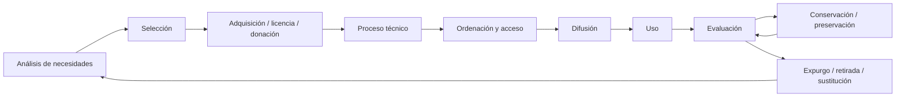

# Tema 12. La gestión de la colección en las bibliotecas universitarias

**Convocatoria:** Escala Técnica Auxiliar de Archivos y Bibliotecas de la Universidad de Alcalá  
**Programa oficial:** Tema 12. *La gestión de la colección en las bibliotecas universitarias. Selección y adquisición, conservación, preservación, ordenación, difusión, evaluación y expurgo. Colecciones especiales y fondo antiguo en la Biblioteca de la Universidad de Alcalá.*

---

## 1. Enfoque de estudio

Este tema se entiende como el ciclo completo de vida de la colección en una biblioteca universitaria: desde la detección de necesidades y la selección de recursos hasta su adquisición, tratamiento, ordenación, difusión, evaluación, conservación, preservación y eventual expurgo. En el caso de la Biblioteca de la Universidad de Alcalá —en adelante BUAH— hay que conectar siempre la teoría general con sus servicios, recursos, colecciones destacadas, repositorios, adquisiciones, acceso al documento, fondo antiguo y colecciones especiales.

### Idea clave

La colección ya no se limita al fondo impreso localizado físicamente en las bibliotecas. En una biblioteca universitaria actual, la colección integra:

- monografías impresas;
- revistas impresas;
- libros electrónicos;
- revistas electrónicas;
- bases de datos;
- recursos web seleccionados;
- repositorios institucionales;
- datos de investigación;
- materiales audiovisuales;
- fondos especiales;
- fondo antiguo;
- colecciones por donación o convenio;
- recursos consorciados o de acceso cooperativo;
- documentos obtenidos mediante préstamo interbibliotecario o acceso al documento.

La gestión de la colección debe, por tanto, equilibrar **pertinencia académica**, **uso real**, **coste**, **accesibilidad**, **conservación**, **licencias**, **preservación a largo plazo** y **difusión**.

---

## 2. Concepto de gestión de la colección

La gestión de la colección es el conjunto de políticas, procedimientos y decisiones mediante los cuales una biblioteca planifica, constituye, organiza, mantiene, evalúa, conserva y renueva sus recursos documentales para responder a las necesidades de sus usuarios.

En una biblioteca universitaria, la colección está al servicio de:

1. la docencia;
2. el aprendizaje;
3. la investigación;
4. la transferencia de conocimiento;
5. la gestión universitaria;
6. la cultura y la extensión universitaria;
7. la preservación del patrimonio bibliográfico y documental.

La BUAH se define, según su documentación estratégica, como un servicio orientado a ofrecer recursos y servicios para el aprendizaje, la docencia, la investigación y la innovación, facilitando la generación, gestión y transmisión del conocimiento. Esta definición encaja directamente con la función de gestión de colecciones: la colección es uno de los activos esenciales mediante los que la biblioteca cumple su propósito institucional.

---

## 3. Ciclo de vida de la colección

La gestión de la colección puede estudiarse como un ciclo:



### Fases principales

| Fase | Pregunta que responde | Resultado esperado |
|---|---|---|
| Análisis de necesidades | ¿Qué necesita la comunidad universitaria? | Perfil de colección ajustado a docencia e investigación |
| Selección | ¿Qué recursos deben incorporarse? | Propuesta de compra, suscripción, licencia, donación o canje |
| Adquisición | ¿Cómo se incorporan formalmente? | Pedido, licencia, alta, recepción o aceptación |
| Ordenación | ¿Cómo se localizan y usan? | Ubicación, signatura, libre acceso, depósito, enlace electrónico |
| Difusión | ¿Cómo se da a conocer la colección? | Catálogo, buscador, guías, exposiciones, redes, formación |
| Evaluación | ¿Sirve la colección? ¿Se usa? ¿Es sostenible? | Indicadores de uso, coste, cobertura, calidad y pertinencia |
| Conservación | ¿Cómo se mantiene en buen estado? | Medidas preventivas y correctivas |
| Preservación | ¿Cómo se garantiza el acceso futuro? | Políticas físicas y digitales a largo plazo |
| Expurgo | ¿Qué se retira, sustituye o reubica? | Colección actualizada, útil y sostenible |

---

## 4. Selección de la colección

La selección es el proceso mediante el cual se decide qué documentos, recursos o contenidos deben incorporarse a la colección.

### 4.1. Criterios generales de selección

En bibliotecas universitarias, la selección se basa en criterios como:

- adecuación a los planes de estudio;
- apoyo a la bibliografía recomendada;
- apoyo a líneas de investigación;
- actualidad científica;
- prestigio editorial o académico;
- calidad técnica del recurso;
- disponibilidad en otras bibliotecas;
- coste de adquisición o licencia;
- condiciones de acceso;
- número potencial de usuarios;
- idioma;
- accesibilidad;
- formato;
- duplicidad;
- preservabilidad;
- compatibilidad con los sistemas de descubrimiento;
- sostenibilidad presupuestaria;
- requisitos de ciencia abierta;
- demanda expresa del PDI, estudiantes o investigadores.

### 4.2. Selección en el entorno impreso

En el fondo impreso, las decisiones de selección atienden especialmente a:

- ejemplares necesarios por asignatura;
- uso intensivo de manuales;
- reposición de ejemplares deteriorados;
- actualización de ediciones;
- equilibrio entre campus y bibliotecas;
- disponibilidad de espacio;
- existencia de ejemplares duplicados;
- valor patrimonial o singular;
- obras de referencia;
- colecciones especiales.

### 4.3. Selección en el entorno electrónico

En recursos electrónicos se incorporan criterios adicionales:

- modelo de licencia;
- número de usuarios simultáneos;
- acceso remoto;
- autenticación;
- compatibilidad con VPN o sistemas institucionales;
- estadísticas COUNTER;
- integración en el buscador;
- cobertura temporal;
- embargos;
- derechos de descarga, impresión, préstamo digital o minería de textos y datos;
- preservación digital;
- interoperabilidad;
- accesibilidad web;
- existencia de DRM;
- posibilidad de adquisición perpetua o suscripción.

### 4.4. Papel de la comunidad universitaria

La selección en bibliotecas universitarias no debe ser una decisión aislada del personal bibliotecario. Debe articularse con:

- profesorado;
- departamentos;
- estudiantes;
- personal investigador;
- órganos de gobierno de la biblioteca;
- responsables de titulaciones;
- unidades de apoyo a la investigación;
- consorcios bibliotecarios.

En el caso de la BUAH, la Comisión de Biblioteca aparece como órgano de gobierno con funciones de orientación y aprobación de directrices generales de funcionamiento del Servicio de Biblioteca. Esto es importante porque la política de colección debe alinearse con la estrategia institucional.

---

## 5. Adquisición

La adquisición es el conjunto de operaciones administrativas y técnicas que permiten incorporar fondos a la colección.

### 5.1. Vías de adquisición

| Vía | Descripción | Ejemplos |
|---|---|---|
| Compra | Adquisición con cargo a presupuesto | Manuales, monografías, libros electrónicos |
| Suscripción | Acceso temporal o renovable | Revistas, bases de datos, paquetes electrónicos |
| Licencia | Contrato de acceso a recursos digitales | Plataformas de e-books, revistas-e |
| Donación | Incorporación gratuita ofrecida por personas o instituciones | Bibliotecas personales, colecciones privadas |
| Canje o intercambio | Intercambio institucional de publicaciones | Publicaciones universitarias |
| Depósito o cesión de uso | Material alojado o usado por convenio | Colecciones cedidas o depositadas |
| Producción propia | Documentos generados por la institución | Tesis, TFG, TFM, artículos, datasets |
| Acceso abierto | Recursos disponibles sin barrera económica | Repositorios, revistas OA, libros OA |

### 5.2. Procedimiento general de adquisición

Un proceso típico incluye:

1. detección de necesidad;
2. comprobación de existencia previa en catálogo o buscador;
3. validación de pertinencia;
4. estimación de coste;
5. selección de proveedor;
6. pedido;
7. recepción o activación;
8. comprobación bibliográfica y administrativa;
9. proceso técnico;
10. puesta a disposición del usuario;
11. comunicación o difusión.

### 5.3. Adquisiciones en la BUAH

La página de Adquisiciones de la BUAH indica que la procedencia del material bibliográfico puede ser variada: instituciones, universidades, acuerdos de intercambio entre universidades, centros u organismos públicos de distintas administraciones, centros internacionales, Unión Europea, centros privados, profesorado de la UAH o particulares.

Esto permite estudiar las adquisiciones en la BUAH no solo como compra, sino también como **incorporación plural de fondos** mediante donación, intercambio y relaciones institucionales.

### 5.4. Desideratas

Una desiderata es una solicitud de adquisición realizada por una persona usuaria. En una biblioteca universitaria, las desideratas permiten recoger necesidades no detectadas previamente, pero no suponen una compra automática. Deben evaluarse conforme a la política de colección.

Criterios para aceptar una desiderata:

- pertinencia para docencia o investigación;
- inexistencia del recurso en la colección;
- actualidad;
- demanda potencial;
- coste razonable;
- disponibilidad;
- ausencia de duplicidad innecesaria;
- adecuación al perfil de la biblioteca.

---

## 6. Conservación

La conservación comprende las medidas destinadas a mantener los documentos en condiciones adecuadas de uso y evitar o ralentizar su deterioro.

### 6.1. Conservación preventiva

La conservación preventiva busca evitar el daño antes de que se produzca. Incluye:

- control de temperatura;
- control de humedad relativa;
- iluminación adecuada;
- limpieza;
- ventilación;
- protección contra plagas;
- control de polvo;
- almacenamiento correcto;
- mobiliario adecuado;
- manipulación correcta;
- formación del personal;
- normas de consulta;
- planes de emergencia;
- control de préstamos y transporte;
- encuadernación o cajas de conservación cuando proceda.

### 6.2. Conservación curativa

La conservación curativa actúa sobre documentos ya dañados para estabilizarlos o evitar deterioros mayores. Puede incluir:

- pequeñas reparaciones;
- limpieza técnica;
- estabilización de soportes;
- sustitución de contenedores;
- aislamiento de fondos afectados;
- restauración especializada cuando sea necesario.

### 6.3. Factores de deterioro

| Factor | Riesgo |
|---|---|
| Humedad elevada | Hongos, deformaciones, oxidación |
| Humedad baja | Fragilidad del papel y pergamino |
| Temperatura alta | Aceleración de reacciones químicas |
| Luz | Decoloración, debilitamiento de soportes |
| Polvo | Suciedad, abrasión, plagas |
| Manipulación incorrecta | Roturas, pérdidas, deformaciones |
| Insectos o roedores | Pérdida material |
| Agua | Ondulación, tintas corridas, hongos |
| Fuego | Pérdida irreversible |
| Mala encuadernación | Daño estructural |
| Uso intensivo | Desgaste, pérdida de hojas, rotura de lomos |

### 6.4. Conservación en bibliotecas universitarias

En bibliotecas universitarias la conservación debe equilibrar dos objetivos:

1. facilitar el uso intensivo de los materiales;
2. garantizar la permanencia de los fondos.

Por eso no se tratan igual:

- manuales de préstamo frecuente;
- revistas antiguas;
- fondo antiguo;
- tesis;
- materiales audiovisuales;
- recursos electrónicos;
- documentos únicos;
- colecciones especiales.

---

## 7. Preservación

La preservación es un concepto más amplio que la conservación. Incluye las políticas, estrategias y acciones destinadas a garantizar el acceso futuro a los documentos, tanto físicos como digitales.

### 7.1. Diferencia entre conservación y preservación

| Concepto | Alcance | Ejemplo |
|---|---|---|
| Conservación | Mantener en buen estado un objeto documental | Control ambiental de un depósito |
| Restauración | Intervenir sobre un documento dañado | Reparar una encuadernación |
| Preservación | Garantizar la permanencia y acceso a largo plazo | Digitalizar, crear copias de seguridad, migrar formatos |
| Preservación digital | Asegurar la disponibilidad de objetos digitales | Repositorios, metadatos, formatos sostenibles |

### 7.2. Preservación digital

La preservación digital es esencial en bibliotecas universitarias porque una parte creciente de la colección es electrónica o nace digital.

Incluye:

- selección de formatos estables;
- metadatos de preservación;
- copias de seguridad;
- control de integridad;
- migración de formatos;
- emulación cuando proceda;
- repositorios confiables;
- identificadores persistentes;
- políticas de acceso;
- documentación de derechos;
- control de versiones;
- interoperabilidad.

### 7.3. Repositorios y preservación

En la BUAH hay que relacionar la preservación con:

- **e_Buah**, repositorio institucional;
- **e-cienciaDatos**, repositorio de datos de investigación;
- recursos de ciencia abierta;
- trabajos académicos;
- producción científica;
- datos de investigación.

Aunque el Tema 12 se centra en colección, no puede separarse del Tema 16 cuando se habla de preservación digital: los repositorios institucionales son instrumentos de difusión, acceso y preservación de la producción académica.

---

## 8. Ordenación de la colección

La ordenación es el conjunto de criterios para disponer físicamente o virtualmente los recursos de forma que sean localizables, accesibles y utilizables.

### 8.1. Ordenación física

En colecciones impresas se combinan:

- clasificación por materias;
- signatura topográfica;
- orden alfabético o numérico;
- colecciones diferenciadas;
- fondos de libre acceso;
- fondos en depósito;
- materiales excluidos de préstamo;
- revistas;
- obras de referencia;
- materiales especiales;
- fondo antiguo.

### 8.2. Libre acceso y depósito

| Modalidad | Características | Ventajas | Riesgos |
|---|---|---|---|
| Libre acceso | El usuario accede directamente al documento | Autonomía, rapidez, visibilidad | Desorden, deterioro, pérdida |
| Depósito | Acceso mediado por personal | Control, conservación, seguridad | Menor inmediatez |
| Acceso electrónico | Acceso por plataforma o buscador | Disponibilidad remota, simultaneidad parcial | Licencias, autenticación, obsolescencia |
| Colección especial | Acceso restringido o mediado | Protección del valor singular | Menor disponibilidad directa |

### 8.3. Ordenación virtual

En colecciones electrónicas, la ordenación se realiza mediante:

- catálogo;
- buscador/discovery;
- listas A/Z;
- metadatos;
- enlaces resolver;
- guías temáticas;
- repositorios;
- páginas de recursos;
- sistemas de autenticación;
- filtros por tipo documental, materia, fecha o disponibilidad.

En la BUAH, la web estructura los recursos en Buscador, Recursos electrónicos, Libros electrónicos, Revistas electrónicas, Guías temáticas y Colecciones destacadas.

---

## 9. Difusión de la colección

La difusión es el conjunto de acciones destinadas a dar visibilidad a la colección y favorecer su uso.

### 9.1. Canales de difusión

- catálogo;
- buscador;
- web de biblioteca;
- guías temáticas;
- sesiones de formación;
- exposiciones bibliográficas;
- redes sociales;
- blogs;
- boletines;
- cartelería;
- recomendaciones;
- campañas;
- integración en aulas virtuales;
- bibliografías recomendadas;
- repositorios;
- actividades culturales;
- colaboración con departamentos.

### 9.2. Difusión en la BUAH

La BUAH utiliza distintos instrumentos de difusión:

- Buscador;
- Recursos electrónicos;
- Libros electrónicos;
- Revistas electrónicas;
- Guías temáticas;
- Colecciones destacadas;
- Fondo antiguo Singularis;
- Premios Cervantes;
- Blog DeCine;
- Catálogo del Centro de Documentación de Fundación MAPFRE;
- Punto Violeta;
- exposiciones y actividades culturales;
- repositorios e_Buah y e-cienciaDatos.

La documentación EFQM de la BUAH menciona la difusión de colecciones especiales con finalidad cultural y social, la colaboración con Extensión Universitaria para exposiciones de los Premios Cervantes y la difusión de colecciones de otras instituciones.

### 9.3. Difusión y formación

La difusión no consiste solo en mostrar recursos. También implica enseñar a utilizarlos. Por ello se vincula con:

- formación en competencias informacionales;
- formación en recursos electrónicos;
- ayuda a estudiantes;
- apoyo al PDI;
- apoyo a la investigación;
- asesoramiento especializado;
- guías temáticas;
- tutoriales.

---

## 10. Evaluación de la colección

La evaluación permite comprobar si la colección responde a las necesidades de la comunidad universitaria y si los recursos se usan de forma eficiente.

### 10.1. Para qué sirve evaluar

- justificar presupuestos;
- detectar lagunas;
- detectar duplicidades;
- renegociar suscripciones;
- decidir expurgos;
- priorizar adquisiciones;
- medir satisfacción;
- conocer uso real;
- apoyar acreditaciones;
- mejorar servicios;
- rendir cuentas;
- planificar espacios;
- orientar la política de colección.

### 10.2. Indicadores cuantitativos

| Indicador | Aplicación |
|---|---|
| Número de títulos | Tamaño de colección |
| Número de ejemplares | Disponibilidad física |
| Préstamos | Uso de colección impresa |
| Renovaciones | Demanda continuada |
| Reservas | Presión de uso |
| Consultas en sala | Uso no prestable |
| Descargas | Uso de recursos electrónicos |
| Búsquedas | Uso de bases de datos |
| Sesiones | Acceso a plataformas |
| Coste por uso | Eficiencia económica |
| Antigüedad media | Actualidad de la colección |
| Tasa de duplicidad | Racionalización |
| Tasa de obsolescencia | Necesidad de actualización |
| Porcentaje de bibliografía recomendada cubierta | Adecuación docente |
| Fondos expurgados | Mantenimiento |
| Documentos restaurados | Conservación |

### 10.3. Indicadores cualitativos

- adecuación a titulaciones;
- opinión de usuarios;
- satisfacción;
- calidad académica;
- prestigio de editoriales o bases de datos;
- cobertura temática;
- equilibrio entre áreas;
- accesibilidad;
- facilidad de uso;
- valor patrimonial;
- singularidad;
- alineamiento estratégico.

### 10.4. REBIUN e indicadores

REBIUN ofrece un marco de comparación entre bibliotecas universitarias españolas. Sus formularios e indicadores permiten recopilar datos de usuarios, recursos humanos, locales, colecciones, recursos electrónicos, consultas, préstamos, gastos y servicios. Estos indicadores son relevantes para evaluar la colección y compararla con otras bibliotecas universitarias.

Especialmente importantes son:

- recursos de información disponibles;
- publicaciones periódicas electrónicas;
- recursos electrónicos de pago;
- consultas y descargas;
- inversión en recursos de información;
- uso de la colección;
- actividad de préstamo;
- acceso al documento.

### 10.5. Coste por uso

El coste por uso es un indicador especialmente relevante en recursos electrónicos.

```text
Coste por uso = Coste anual del recurso / Número de usos registrados
```

Ejemplo:

| Recurso | Coste anual | Descargas/consultas | Coste por uso |
|---|---:|---:|---:|
| Base de datos A | 10.000 € | 5.000 | 2 € |
| Revista electrónica B | 2.000 € | 100 | 20 € |
| Paquete C | 40.000 € | 80.000 | 0,50 € |

Un coste por uso alto no implica automáticamente cancelar un recurso: puede tratarse de un recurso muy especializado, necesario para investigación avanzada o estratégico para un área concreta.

---

## 11. Expurgo

El expurgo es el proceso de retirar, reubicar, sustituir o dar de baja documentos que ya no deben permanecer en una colección determinada.

### 11.1. Qué no es el expurgo

El expurgo no es:

- destrucción arbitraria;
- pérdida de patrimonio;
- simple eliminación de libros viejos;
- decisión improvisada;
- actuación sin registro.

El expurgo debe estar regulado, documentado y justificado.

### 11.2. Objetivos del expurgo

- mantener la colección actualizada;
- liberar espacio;
- mejorar la localización;
- reducir ruido documental;
- retirar ejemplares deteriorados;
- eliminar duplicados innecesarios;
- sustituir ediciones obsoletas;
- mejorar la imagen de la biblioteca;
- optimizar costes de almacenamiento;
- proteger fondos valiosos trasladándolos a depósitos adecuados.

### 11.3. Criterios de expurgo

| Criterio | Aplicación |
|---|---|
| Obsolescencia | Manuales científicos desactualizados |
| Deterioro | Ejemplares rotos, incompletos o ilegibles |
| Duplicidad | Exceso de copias sin uso |
| Falta de uso | Sin préstamos ni consultas durante años |
| Inadecuación temática | Fuera del perfil de colección |
| Sustitución | Nueva edición disponible |
| Disponibilidad digital | Recurso accesible electrónicamente |
| Espacio | Necesidad de racionalizar estanterías |
| Valor patrimonial | Excluir del expurgo o reubicar |
| Singularidad | Conservar ejemplares únicos |

### 11.4. Criterios especiales

No deben expurgarse sin análisis específico:

- fondo antiguo;
- ejemplares raros;
- primeras ediciones;
- obras con anotaciones relevantes;
- obras de autores vinculados a la institución;
- fondos donados con condiciones;
- materiales patrimoniales;
- obras no disponibles en otras bibliotecas;
- publicaciones de la propia Universidad;
- tesis u obras institucionales;
- documentos con valor histórico local.

### 11.5. Procedimiento de expurgo

1. Definir criterios.
2. Generar listados candidatos.
3. Revisar físicamente o digitalmente.
4. Consultar uso, antigüedad y duplicidad.
5. Valorar relevancia académica.
6. Separar fondos patrimoniales o especiales.
7. Proponer destino.
8. Autorizar.
9. Registrar baja o cambio de ubicación.
10. Retirar, donar, reciclar, sustituir o enviar a depósito.
11. Evaluar resultado.

### 11.6. Destinos posibles

- mantenimiento en colección;
- traslado a depósito;
- restauración;
- sustitución por nueva edición;
- donación;
- intercambio;
- baja definitiva;
- reciclaje;
- digitalización, cuando proceda y sea legalmente posible;
- conservación patrimonial.

---

## 12. Colecciones especiales

Las colecciones especiales son conjuntos documentales que, por su origen, temática, rareza, valor cultural, forma de adquisición o singularidad, reciben un tratamiento diferenciado.

### 12.1. Características

- valor histórico, cultural, académico o institucional;
- procedencia singular;
- condiciones específicas de uso;
- tratamiento bibliográfico especial;
- medidas de conservación reforzadas;
- difusión diferenciada;
- posible restricción de préstamo;
- integración en exposiciones o proyectos culturales;
- descripción detallada de procedencia.

### 12.2. Tipos de colecciones especiales

| Tipo | Ejemplo |
|---|---|
| Donaciones personales | Bibliotecas privadas incorporadas |
| Colecciones temáticas | Literatura chicana, literatura norteamericana |
| Colecciones institucionales | Instituto Cervantes, British Council |
| Fondos patrimoniales | Fondo antiguo |
| Colecciones culturales | Premios Cervantes |
| Centros documentales | Centro de Documentación Europea |
| Colecciones depositadas | Fondos cedidos por convenio |
| Colecciones sociales | Punto Violeta |
| Colecciones audiovisuales | Cine, documentales |

### 12.3. Colecciones destacadas en la BUAH

Según la web de la BUAH, dentro de sus recursos se identifican apartados como:

- Colecciones destacadas;
- Fondo antiguo Singularis;
- Premios Cervantes;
- Blog DeCine;
- Catálogo Centro de Documentación de Fundación MAPFRE;
- Punto Violeta.

Además, algunas bibliotecas concretas presentan colecciones singulares. Por ejemplo, la Biblioteca del Edificio de Trinitarios incluye colecciones como la Donación British Council, literatura norteamericana, literatura chicana, Donación Martín de Riquer, Donación William Chislett, colección del Instituto Universitario de Investigación en Estudios Norteamericanos Benjamin Franklin y Donación del Instituto de Cultura Gitana.

El CRAI-Biblioteca menciona, entre otras, la colección Ocio y la colección Instituto Cervantes, ubicada en el CRAI desde 2021 por acuerdo de cesión del Instituto Cervantes de Madrid como préstamo de uso.

El Centro de Documentación Europea de la UAH nace fruto de un convenio entre la Universidad de Alcalá y la Comisión Europea para facilitar el acceso a publicaciones oficiales de la Unión Europea y difundir sus políticas.

---

## 13. Fondo antiguo

El fondo antiguo es el conjunto de documentos bibliográficos de especial valor histórico, patrimonial o cultural, generalmente por su antigüedad, rareza, procedencia, soporte, encuadernación, ilustración o singularidad.

### 13.1. Elementos que pueden integrar el fondo antiguo

- manuscritos;
- incunables;
- impresos antiguos;
- libros raros;
- primeras ediciones;
- mapas;
- grabados;
- pergaminos;
- obras con encuadernaciones artísticas;
- publicaciones anteriores a una fecha determinada;
- obras con exlibris, anotaciones o procedencias relevantes;
- documentos vinculados a la historia institucional.

### 13.2. Tratamiento del fondo antiguo

El fondo antiguo requiere:

- descripción bibliográfica rigurosa;
- control de autoridades;
- identificación de ejemplar;
- descripción de procedencia;
- descripción de encuadernación;
- registro de marcas de posesión;
- medidas especiales de conservación;
- consulta controlada;
- manipulación supervisada;
- limitación o exclusión de préstamo;
- digitalización selectiva;
- planes de emergencia;
- control ambiental;
- seguridad.

### 13.3. Fondo antiguo en la BUAH

El programa oficial menciona expresamente las colecciones especiales y el fondo antiguo en la Biblioteca de la Universidad de Alcalá. En la web de la BUAH aparece el recurso **Fondo antiguo Singularis**, vinculado a la difusión del fondo antiguo.

Para estudiar este apartado conviene recordar:

- la UAH actual fue refundada en 1977;
- la institución se vincula históricamente con la Universidad Cisneriana fundada en 1499;
- la ciudad universitaria de Alcalá fue declarada Patrimonio de la Humanidad por la UNESCO en 1998;
- la BUAH gestiona y difunde colecciones especiales con finalidad cultural y social;
- el fondo antiguo requiere una gestión diferenciada por su valor patrimonial.

### 13.4. Conservación del fondo antiguo

Las pautas generales de conservación del fondo antiguo son:

- depósitos estables;
- control ambiental;
- protección frente a luz directa;
- cajas de conservación;
- soportes adecuados en consulta;
- no forzar aperturas;
- uso de atriles;
- manipulación con manos limpias o guantes cuando proceda;
- reducción de fotocopias directas;
- digitalización como medida de acceso y preservación;
- planes de emergencia frente a agua, fuego o plagas;
- registro de incidencias.

### 13.5. Difusión del fondo antiguo

La difusión del fondo antiguo se realiza mediante:

- catálogos;
- exposiciones;
- repositorios digitales;
- digitalización;
- visitas guiadas;
- actividades culturales;
- publicaciones;
- redes sociales;
- colaboración con investigadores;
- proyectos patrimoniales.

La difusión debe equilibrarse siempre con la conservación: cuanto más valioso o frágil es el material, más importante es ofrecer reproducciones digitales o acceso mediado.

---

## 14. Relación con otros temas del programa

| Tema | Relación con el Tema 12 |
|---|---|
| Tema 10 | Misión, visión, estructura y reglamento de la BUAH condicionan la política de colección |
| Tema 11 | Organización espacial, libre acceso, depósitos y equipamiento condicionan ordenación y conservación |
| Tema 13 | Proceso técnico, MARC 21, FRBR y RDA permiten describir y recuperar la colección |
| Tema 15 | Clasificación bibliográfica y CDU afectan a ordenación física y recuperación |
| Tema 16 | Repositorios, ciencia abierta y datos de investigación forman parte de la colección digital |
| Tema 17 | Servicios al usuario difunden y median el acceso a la colección |
| Tema 18 | Préstamo y acceso al documento son vías de uso de la colección |
| Tema 19 | LSP y buscador son infraestructura para descubrir y gestionar la colección |
| Tema 20 | REBIUN y Madroño influyen en adquisición cooperativa, indicadores y acceso compartido |
| Tema 21 | Calidad, EFQM e indicadores permiten evaluar la gestión de la colección |

---

## 15. Esquema de respuesta para examen

### Pregunta posible

**Explique la gestión de la colección en las bibliotecas universitarias y su aplicación en la Biblioteca de la Universidad de Alcalá.**

### Respuesta estructurada

1. Definir gestión de la colección.
2. Explicar que la colección universitaria incluye recursos impresos, electrónicos, repositorios, datos, fondos especiales y fondo antiguo.
3. Desarrollar las fases:
   - selección;
   - adquisición;
   - conservación;
   - preservación;
   - ordenación;
   - difusión;
   - evaluación;
   - expurgo.
4. Aplicar a la BUAH:
   - Buscador;
   - recursos electrónicos;
   - libros y revistas electrónicas;
   - guías temáticas;
   - colecciones destacadas;
   - e_Buah;
   - e-cienciaDatos;
   - Fondo antiguo Singularis;
   - Premios Cervantes;
   - colecciones especiales como British Council, Instituto Cervantes, Benjamin Franklin, literatura chicana, Centro de Documentación Europea.
5. Concluir destacando que la gestión de la colección debe ser planificada, evaluable, sostenible, orientada al usuario y alineada con la misión universitaria.

---

## 16. Preguntas tipo test

### 1. ¿Cuál de las siguientes operaciones forma parte de la gestión de la colección?
a) Solo la catalogación.  
b) Solo el préstamo.  
c) Selección, adquisición, conservación, difusión, evaluación y expurgo.  
d) Solo la colocación física de libros.

**Respuesta correcta:** c)

### 2. El expurgo consiste en:
a) Destruir todos los libros antiguos.  
b) Retirar, reubicar o dar de baja documentos conforme a criterios establecidos.  
c) Comprar nuevos libros.  
d) Digitalizar todos los fondos.

**Respuesta correcta:** b)

### 3. En recursos electrónicos, un indicador clave de evaluación es:
a) El color de la cubierta.  
b) El coste por uso.  
c) El tamaño físico.  
d) El número de estanterías.

**Respuesta correcta:** b)

### 4. La conservación preventiva busca:
a) Reparar siempre los documentos dañados.  
b) Evitar o retrasar el deterioro antes de que se produzca.  
c) Eliminar ejemplares duplicados.  
d) Sustituir recursos impresos por electrónicos.

**Respuesta correcta:** b)

### 5. Una colección especial se caracteriza por:
a) Ser siempre de libre préstamo.  
b) Tener valor singular por su procedencia, temática, rareza o valor cultural.  
c) Estar formada solo por manuales.  
d) No necesitar catalogación.

**Respuesta correcta:** b)

### 6. En la BUAH, un recurso asociado a fondo antiguo es:
a) Singularis.  
b) Google Scholar.  
c) Scopus.  
d) Zotero.

**Respuesta correcta:** a)

### 7. La evaluación de la colección permite:
a) Justificar presupuestos y orientar adquisiciones.  
b) Evitar la catalogación.  
c) Impedir el préstamo.  
d) Eliminar la formación de usuarios.

**Respuesta correcta:** a)

### 8. La preservación digital incluye:
a) Solo encuadernar libros.  
b) Migración de formatos, metadatos, copias de seguridad y control de integridad.  
c) Ordenar libros por tamaño.  
d) Excluir recursos electrónicos.

**Respuesta correcta:** b)

---

## 17. Glosario

**Adquisición:** incorporación formal de recursos documentales a la colección por compra, suscripción, licencia, donación, canje u otras vías.

**Canje:** intercambio de publicaciones entre instituciones.

**Colección:** conjunto organizado de recursos documentales, físicos y digitales, que una biblioteca pone al servicio de sus usuarios.

**Colección especial:** fondo diferenciado por su valor, procedencia, temática, rareza o singularidad.

**Conservación:** acciones destinadas a mantener los documentos en buen estado.

**Conservación preventiva:** medidas para evitar el deterioro antes de que se produzca.

**Desiderata:** solicitud de adquisición realizada por una persona usuaria.

**Expurgo:** retirada, reubicación o baja de documentos según criterios definidos.

**Fondo antiguo:** conjunto de documentos con valor histórico, patrimonial o bibliográfico.

**Libre acceso:** sistema en el que los usuarios acceden directamente a los documentos en estantería.

**Preservación:** políticas y acciones para asegurar la permanencia y acceso futuro a los documentos.

**Preservación digital:** medidas para garantizar la disponibilidad futura de objetos digitales.

**Repositorio institucional:** plataforma para conservar, organizar y difundir producción académica de una institución.

**Signatura topográfica:** código que indica la ubicación física de un documento.

---

## 18. Mapa mental resumido

```text
GESTIÓN DE LA COLECCIÓN
│
├── Selección
│   ├── Necesidades docentes
│   ├── Investigación
│   ├── Bibliografía recomendada
│   └── Demandas de usuarios
│
├── Adquisición
│   ├── Compra
│   ├── Suscripción
│   ├── Licencia
│   ├── Donación
│   └── Canje
│
├── Ordenación
│   ├── Libre acceso
│   ├── Depósitos
│   ├── Signaturas
│   └── Acceso electrónico
│
├── Difusión
│   ├── Buscador
│   ├── Guías temáticas
│   ├── Exposiciones
│   ├── Formación
│   └── Repositorios
│
├── Evaluación
│   ├── Uso
│   ├── Coste
│   ├── Cobertura
│   ├── Satisfacción
│   └── Indicadores REBIUN
│
├── Conservación y preservación
│   ├── Control ambiental
│   ├── Manipulación
│   ├── Digitalización
│   └── Preservación digital
│
└── Expurgo
    ├── Obsolescencia
    ├── Duplicidad
    ├── Deterioro
    └── Reubicación o baja
```

---

## 19. Puntos críticos para memorizar

1. La colección universitaria es híbrida: física, electrónica, digital, institucional, patrimonial y consorciada.
2. La gestión de colección es un ciclo, no una tarea aislada.
3. La selección debe responder a docencia, aprendizaje e investigación.
4. La adquisición puede hacerse por compra, suscripción, licencia, donación, intercambio o producción propia.
5. La conservación se centra en el estado físico; la preservación en el acceso futuro.
6. La ordenación afecta tanto a estanterías como a sistemas digitales.
7. La difusión es esencial para que la colección se use.
8. La evaluación mide pertinencia, uso, coste, cobertura y satisfacción.
9. El expurgo es una decisión técnica, documentada y justificada.
10. El fondo antiguo y las colecciones especiales requieren tratamiento diferenciado.
11. En la BUAH hay que citar Fondo antiguo Singularis, Colecciones destacadas, Premios Cervantes, e_Buah, e-cienciaDatos, recursos electrónicos, guías temáticas y colecciones singulares de sus bibliotecas.
12. REBIUN aporta indicadores y marco comparativo para bibliotecas universitarias.

---

## 20. Referencias y fuentes de estudio

### Convocatoria oficial

- Universidad de Alcalá / BOE. Resolución de 6 de octubre de 2025, por la que se convocan pruebas selectivas para ingreso en la Escala Técnica Auxiliar de Archivos y Bibliotecas.  
  https://www.uah.es/export/sites/uah/es/empleo-publico/PAS/.galleries/Funcionario/2025/E.-Tec.-Aux.-Archivos-y-B.-Publicacion-BOE-14.10.25.pdf

### Biblioteca de la Universidad de Alcalá

- Biblioteca de la Universidad de Alcalá. Página principal.  
  https://biblioteca.uah.es/

- Biblioteca de la Universidad de Alcalá. Adquisiciones.  
  https://biblioteca.uah.es/conoce-la-biblioteca/servicios/adquisiciones/

- Biblioteca de la Universidad de Alcalá. Biblioteca en línea.  
  https://biblioteca.uah.es/conoce-la-biblioteca/la-biblioteca/biblioteca-en-linea/

- Biblioteca de la Universidad de Alcalá. Organización y contacto.  
  https://biblioteca.uah.es/conoce-la-biblioteca/la-biblioteca/organizacion-y-contacto/

- Biblioteca de la Universidad de Alcalá. Normativa.  
  https://biblioteca.uah.es/conoce-la-biblioteca/estrategia-y-calidad/normativa/

- Biblioteca de la Universidad de Alcalá. Acceso al documento.  
  https://biblioteca.uah.es/conoce-la-biblioteca/servicios/acceso-al-documento/

- Biblioteca de la Universidad de Alcalá. Preguntas frecuentes.  
  https://biblioteca.uah.es/ayuda/autoayuda/preguntas-frecuentes/

- Biblioteca de la Universidad de Alcalá. Biblioteca del Edificio de Trinitarios.  
  https://biblioteca.uah.es/conoce-la-biblioteca/la-biblioteca/bibliotecas/Biblioteca-del-Edificio-de-Trinitarios/

- Biblioteca de la Universidad de Alcalá. CRAI-Biblioteca.  
  https://biblioteca.uah.es/conoce-la-biblioteca/la-biblioteca/bibliotecas/CRAI-Biblioteca-00002/

- Biblioteca de la Universidad de Alcalá. Biblioteca de Ciencias.  
  https://biblioteca.uah.es/conoce-la-biblioteca/la-biblioteca/bibliotecas/Biblioteca-de-Ciencias/

- Biblioteca de la Universidad de Alcalá. Centro de Documentación Europea.  
  https://biblioteca.uah.es/conoce-la-biblioteca/la-biblioteca/bibliotecas/Centro-de-Documentacion-Europea-00002/

- Biblioteca de la Universidad de Alcalá. Repositorio de datos e-cienciaDatos.  
  https://biblioteca.uah.es/ayuda/autoayuda/noticias/Repositorio-de-datos-e-cienciaDatos/

- Biblioteca de la Universidad de Alcalá. Memoria EFQM Biblioteca de la Universidad de Alcalá 2023.  
  https://biblioteca.uah.es/export/sites/biblioteca/.galleries/Galeria-Documentos-Calidad/Memoria_EFQM_BUAH_2023.pdf

- Biblioteca de la Universidad de Alcalá. Memoria del Servicio de Biblioteca 2018.  
  https://biblioteca.uah.es/export/sites/biblioteca/.galleries/Galeria-Documentos-Calidad/Memoria_2018.pdf

- Biblioteca de la Universidad de Alcalá. Memoria 2017.  
  https://biblioteca.uah.es/export/sites/biblioteca/.galleries/Galeria-Documentos-Calidad/Memoria_2017.pdf

### REBIUN y bibliotecas universitarias

- REBIUN. Estadísticas.  
  https://www.rebiun.org/grupos-trabajo/estadisticas

- REBIUN. Indicadores REBIUN. Campaña 2024.  
  https://www.rebiun.org/sites/default/files/2025-04/Indicadores_rebiun_2024_1.pdf

- REBIUN. Ayuda indicadores. Campaña 2025.  
  https://www.rebiun.org/sites/default/files/2026-04/Ayuda_2025.pdf

- REBIUN. Objetivos estándares para bibliotecas universitarias y científicas.  
  https://www.rebiun.org/sites/default/files/2017-11/IIIPE_Linea%204_Objetivos%20Esta%CC%81ndares%20para%20bibliotecas%20REBIUN_2014.pdf

- REBIUN. Competencias profesionales.  
  https://rebiun.org/competencias-profesionales/colabora

- Herrera Morillas, José Luis. La gestión de la colección en las bibliotecas universitarias españolas.  
  https://redc.revistas.csic.es/index.php/redc/article/view/886/1226

### Conservación, preservación y fondo antiguo

- IFLA. Principles for the Care and Handling of Library Materials.  
  https://www.ifla.org/files/assets/pac/ipi/ipi1-en.pdf

- IFLA. Preservation and Conservation Section.  
  https://www.ifla.org/units/preservation-and-conservation/

- IFLA. Guidelines for Digitization Projects for Collections and Holdings in the Public Domain.  
  https://www.ifla.org/files/assets/preservation-and-conservation/publications/digitization-projects-guidelines.pdf

- IFLA. Cultural Heritage Guidelines and Standards.  
  https://www.ifla.org/cultural-heritage-guidelines-and-standards/

- UNESCO. Guidelines on preservation and conservation policies in the archives and libraries heritage programme.  
  https://unesdoc.unesco.org/ark:/48223/pf0000086345

- Biblioteca Nacional de España. La preservación en la Biblioteca Nacional de España.  
  https://www.bne.es/sites/default/files/repositorio-archivos/preservacion_BNE.pdf

- Biblioteca Nacional de España. Departamento de Preservación y Conservación de Fondos.  
  https://www.bne.es/es/sobre-nosotros/organizacion/organigrama/direccion/direccion-tecnica/departamento-preservacion-conservacion

- Biblioteca Nacional de España. Sobre la conservación del fondo antiguo en bibliotecas españolas.  
  https://bne.es/es/blog/biblioteconomia/2019/11/20/sobre-la-conservacion-del-fondo-antiguo-en-bibliotecas-espanolas

### Normativa ética y expurgo

- REBIUN. Normas de conducta ética para bibliotecarios.  
  https://repositorio.rebiun.org/bitstream/handle/20.500.11967/500/Normas%20de%20conducta.pdf?isAllowed=y&sequence=1

---

## 21. Miniresumen final

La gestión de la colección en bibliotecas universitarias comprende la planificación y administración integral de los recursos documentales físicos, electrónicos y digitales. Incluye selección, adquisición, conservación, preservación, ordenación, difusión, evaluación y expurgo. En el contexto de la Biblioteca de la Universidad de Alcalá, el tema debe aplicarse a una colección híbrida y distribuida, formada por recursos impresos, electrónicos, repositorios, colecciones destacadas, fondos especiales y fondo antiguo. La BUAH articula esta gestión mediante servicios como adquisiciones, buscador, recursos electrónicos, guías temáticas, repositorios, acceso al documento, difusión cultural y fondos singulares como Fondo antiguo Singularis o Premios Cervantes. El objetivo final es garantizar una colección pertinente, accesible, evaluable, sostenible y alineada con la docencia, la investigación y la misión universitaria.
